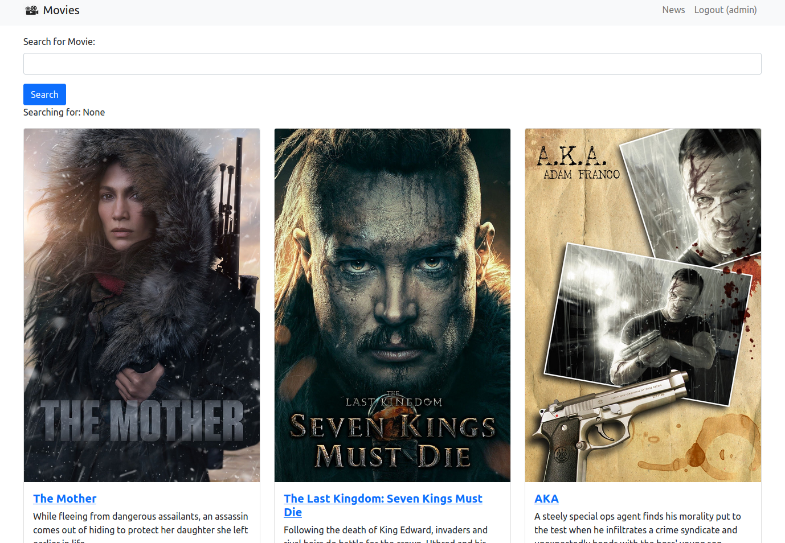
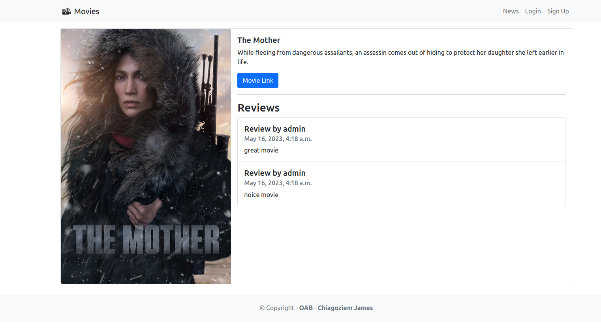

# MovieReview Website

The MovieReview Website is a basic web application built using the Django web framework and Bootstrap. It provides a platform for movie enthusiasts to share their reviews, ratings, and recommendations for various films. This website aims to create a user-friendly and visually appealing experience for users to discover new movies, engage in discussions, and make informed decisions about what to watch next.





## Features

- __Movie Database__: The website leverages a comprehensive movie database to offer a wide range of movies for users to explore. Each movie listing includes essential information such as title, genre, release date, and synopsis.

- __User Reviews__ and Ratings: Users can submit their reviews and ratings for movies they have watched. This feature encourages interaction and enables users to share their opinions and perspectives with the community.

- __User Authentication__: The website implements user authentication functionality, allowing users to create accounts, log in, and log out. This ensures secure access to features like submitting reviews, rating movies, and participating in discussions.

- __Search and Filters__: The website provides a search bar and various filters to help users find specific movies or narrow down their choices based on genre, release date, or other criteria. This enhances the browsing experience and facilitates efficient movie discovery.

- __Responsive Design__: The website is built using Bootstrap, a popular CSS framework that ensures responsiveness and compatibility across different devices and screen sizes. Users can access and navigate the website seamlessly from desktops, laptops, tablets, and mobile devices.

- __Discussion Forum__: The website includes a discussion forum where users can engage in conversations about movies. They can create new threads, reply to existing ones, and interact with other users, fostering a vibrant community of film enthusiasts.

## Technologies Used

- __Django__: The MovieReview Website is developed using Django, a high-level Python web framework that simplifies the process of building web applications. Django provides powerful features such as URL routing, database integration, user authentication, and template rendering.

- __Bootstrap__: The website utilizes Bootstrap, a popular CSS framework, to create a visually appealing and responsive user interface. Bootstrap offers a wide range of pre-designed components and styles, making it easier to build a modern and mobile-friendly website.

- __HTML5 and CSS3__: The website incorporates HTML5 and CSS3 to structure and style the web pages. HTML5 provides semantic markup elements, while CSS3 offers extensive styling capabilities, enabling a visually appealing and well-structured user interface.

- __JavaScript__: JavaScript is used to add interactivity and enhance the user experience. It allows for dynamic content updates, form validation, and other client-side functionalities within the website.

- __Database__: The website integrates a database system like PostgreSQL or SQLite to store movie data, user profiles, reviews, ratings, and other relevant information.

## Getting Started

To set up the MovieReview Website locally, follow these steps:
1. Clone the repository:
    ```shell
    git clone https://github.com/chiagoziemng/movie_review.git
    ```

2. Install the project dependencies:
    ```shell
    cd movie-review-website
    pip install -r requirements.txt
    ```

3. Configure the database settings in the _settings.py_ file.

4. Apply the database migrations:
    ```shell
    python manage.py migrate
    ```

5. Start the development server:
    ```shell
    python manage.py runserver
    ```

6. Access the website by visiting http://localhost:8000 in your web browser.

## Contributing

Contributions are welcome! If you find any issues or have suggestions for improvements, please follow these guidelines:

1. Fork the repository: Click on the "Fork" button on the project's GitHub page to create a fork in your own GitHub account.
2. Create a new branch: Switch to a new branch where you'll make your changes using __git checkout -b branch-name.__
3. Make your modifications: Implement your changes, fix bugs, or add new features.
4. Test your changes: Ensure that your changes do not introduce any regressions and that the project builds successfully.
5. Commit and push: Commit your changes and push them to your forked repository.
6. Open a pull request: Go to the original repository and open a pull request, describing your changes and why they should be merged.

Please adhere to the project's coding style, maintain proper documentation, and write unit tests for any new functionality.
